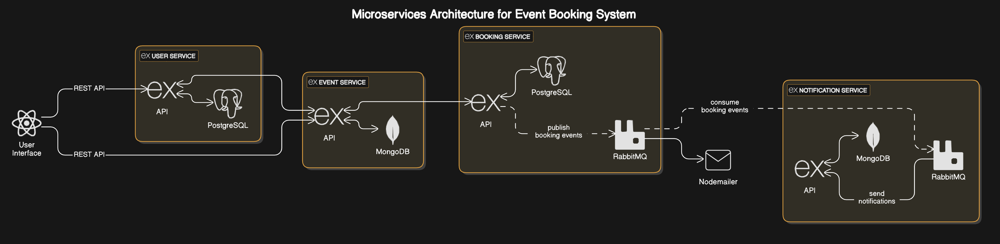

cat <<EOL > README.md
# CS4067-Assgt-EventBooking-i220786-Bilal-i220937-Haleema-repo
Assignment 1 of DevOps Course
This repository contains a microservices-based online event booking system.

## 📂 Repository Structure
- **user-service/** → Handles user authentication & profiles.
- **event-service/** → Manages event creation and updates.
- **booking-service/** → Handles event bookings and payments.
- **notification-service/** → Manages email/SMS notifications.
- **docs/** → Documentation for setup, API specs, and architecture.

## 🚀 Getting Started
1. Clone the repository:
   \`\`\`sh
   git clone https://github.com/orgs/bilalkhawar76/CS4067-Assgt-EventBooking-i220786-Bilal-i220937-Haleema-repo.git
   \`\`\`
2. Navigate to the respective microservice folder and follow its setup instructions.

## Architectural Diagram
This module contains the implementation of the main functionality.

## 📜 License
This project is for academic purposes (CS4067 - DevOps).
